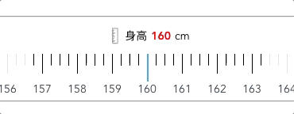

## sliding-meters

一个移动端身高选择（滑动尺）开箱即用的 Vue3 小组件

**效果图如下**



**技术栈**

- vue-cli
- better-scroll
- vue3

**配置项**

#### 属性

|   属性名    |  类型  | 默认值  |            说明            |
| :---------: | :----: | :-----: | :------------------------: |
| min-height  | String | 140(cm) |     米尺开始的最小身高     |
| init-cursor | String | 160(cm) |        初始指针位置        |
|  duration   | Number | 300(ms) | 米尺滑动吸附的动效持续时间 |

#### 方法

|   名称   |       说明       | 参数 |
| :------: | :--------------: | :--: |
| accepted | 滚动结束返回的值 |  -   |

**示例**

```js
<template>
    <SlidingMeters
        init-cursor="170"
        min-height="160"
        :duration="350"
        @accepted="test"
    />
</template>
<script lang="ts" setup>
import SlidingMeters from "SlidingMeters";

const test = (height: string) => {console.log(height)};
</script>
```
